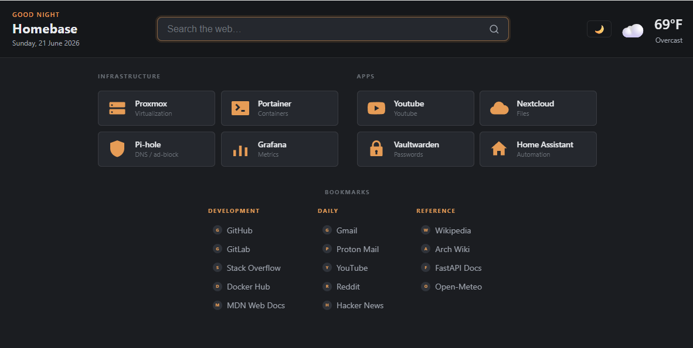

# Homebase

A tiny, self-hosted start page / dashboard. An **Applications** grid up top and
grouped **Bookmarks** below (modeled on [Flame](https://github.com/pawelmalak/flame)),
plus a weather widget and a web-search box. A single admin logs in to add links and
pick icons through a UI; everyone else just sees a fast, clean page.

Its signature feature: **export the entire dashboard as a single, self-contained
static HTML file** — weather and search included — that works with no server, so it
can be synced to a docs folder or committed to a repo.



## Why

Existing self-hosted dashboards force a bad trade. The polished ones (Homarr, Dashy)
are heavy and do far more than needed; the lean ones (Flame, Homepage, Homer) lean on
hand-edited YAML you edit-and-rebuild. Homebase is deliberately small: log in, add a
link, get a nice icon, done — and take the whole board with you as a portable file.

**Non-negotiables** (see [CLAUDE.md](CLAUDE.md) for the full list):

- **One user.** A single admin with a password. No multi-user, roles, or SSO.
- **No hand-edited config.** Data lives in one JSON file the *UI* owns.
- **The render is static.** Server-rendered HTML + a little vanilla JS. No SPA.
- **Live page and export share one renderer.** Export = render the current view with
  everything inlined.

## Stack

- **Backend:** Python 3.12, FastAPI, Jinja2 — single Docker container.
- **Data:** one `data/dashboard.json` file. No database, no ORM.
- **Frontend:** server-rendered Jinja templates + CSS custom properties + vanilla JS
  for the three dynamic bits (icon picker, weather fetch, search). HTMX on admin forms.
- **Auth:** single admin; bcrypt password hash + signed session cookie.
- **External services (all keyless):** [Iconify](https://iconify.design) (icon search),
  [Open-Meteo](https://open-meteo.com) (weather + geocoding), jsDelivr CDNs
  (selfh.st / dashboard-icons logos).

## Quick start

### Docker (recommended)

```bash
docker compose up -d
```

Then open <http://localhost:8080>. On first run there is no admin account — visiting
`/login` redirects to `/setup`, where you create the admin username and password in
the browser. Credentials and an auto-generated session secret are written to
`data/auth.json` on the mounted volume.

### Local (dev)

```bash
pip install -r requirements.txt          # or: uv pip install -r requirements.txt
uvicorn app.main:app --reload
```

## Configuration

All environment variables are **optional overrides** — copy `.env.example` to `.env`
only if you need them. By default everything is configured through the admin UI and
stored on the data volume.

| Variable              | Purpose                                                        |
|-----------------------|----------------------------------------------------------------|
| `DATA_PATH`           | Path to `dashboard.json` (default `/data/dashboard.json`).      |
| `ADMIN_USERNAME`      | Override the web-created admin username.                        |
| `ADMIN_PASSWORD_HASH` | Override the web-created bcrypt password hash.                  |
| `SESSION_SECRET`      | Cookie signing secret (auto-generated into `auth.json` if unset).|

When set, these env vars take precedence over the web-created credentials in
`data/auth.json`.

### Resetting the admin password

`set-password` rewrites the stored credentials:

```bash
# local
python -m app.cli set-password

# container
docker compose exec homebase python -m app.cli set-password
```

## Routes

| Path      | Purpose                                          |
|-----------|--------------------------------------------------|
| `/`       | Dashboard view (public or login-required).       |
| `/login`  | Admin login (redirects to `/setup` on first run).|
| `/setup`  | First-run admin account creation.                |
| `/admin`  | Admin panel — apps, bookmarks, settings, export. |
| `/export/download` | Download the standalone HTML export.    |
| `/healthz`| Liveness check.                                  |

## Features

- **Applications grid** and grouped **Bookmarks**, edited entirely through the UI
  (drag-to-reorder, inline saves via HTMX).
- **Icon picker with consistency built in** — search Iconify by app or glyph name,
  grab a favicon, or use a full-color brand logo. A global `icon_style`
  (`monochrome` | `color`) is enforced at render time so the whole board reads as one
  set. Icons are stored inline as sanitized SVG, so the JSON is self-contained.
- **Weather** widget configured by city name (geocoded once via Open-Meteo, fetched
  live client-side) and a **search** box pointed at any engine URL — both keyless and
  client-side, so they keep working in the export.
- **Themes** (`nord`, `slate`, `sage`) as CSS-variable files, with independent
  light/dark mode. **Layouts** (`flame`, `detailed`) as single Jinja templates.
- **Static export** to a single `index.html`, auto-written on every save and available
  via a download button.

## Backup

Everything lives under `data/` (the mounted volume): `dashboard.json`, `auth.json`,
and `export/index.html`. Back up = copy the folder.

## Documentation

- [PRD.md](PRD.md) — *what* we're building and acceptance criteria.
- [ARCHITECTURE.md](ARCHITECTURE.md) — *how* it works (data model, renderer, icon
  consistency engine, endpoints).
- [ROADMAP.md](ROADMAP.md) — *in what order* (P0–P2 are v1, complete).
- [CLAUDE.md](CLAUDE.md) — repo conventions and non-negotiables.

## Security posture

Designed for LAN / Tailscale or behind a reverse proxy with an identity provider.
Don't expose the bespoke login raw to the internet — front it. All externally fetched
SVGs (Iconify, favicons, uploads) are sanitized with `lxml` before storage.
